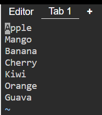
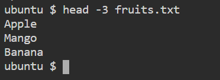
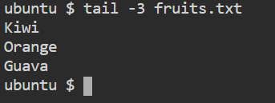
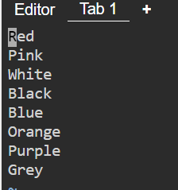
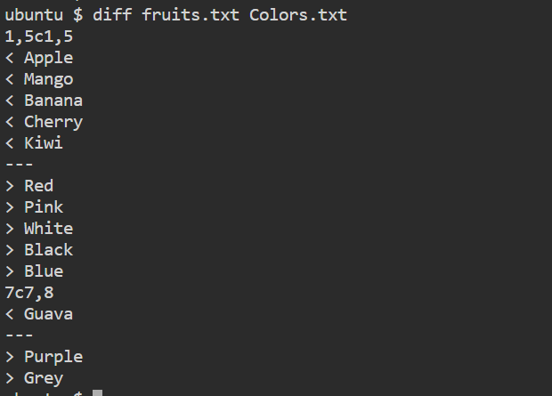

1. To view what's written in a file.

    ```cat test.txt```
 
2. To change the access permissions of files.
    
    ```chmod +7 test.txt```

3. To check which commands you have run till now.

    ```history```

4. To remove a directory/ Folder.

    ```rm <folder_name>```

5. To create a fruits.txt file and to view the content.

    ```vim fruits.txt```

6. Add content in devops.txt (One in each line) - Apple, Mango, Banana, Cherry, Kiwi, Orange, Guava.

        

7. To Show only top three fruits from the file.

    

8. To Show only bottom three fruits from the file.

    

9. To create another file Colors.txt and to view the content.

    ``vim Colors.txt``

10. Add content in Colors.txt (One in each line) - Red, Pink, White, Black, Blue, Orange, Purple, Grey.

    

11. To find the difference between fruits.txt and Colors.txt file.

    ``diff fruits.txt Colors.txt``    
    